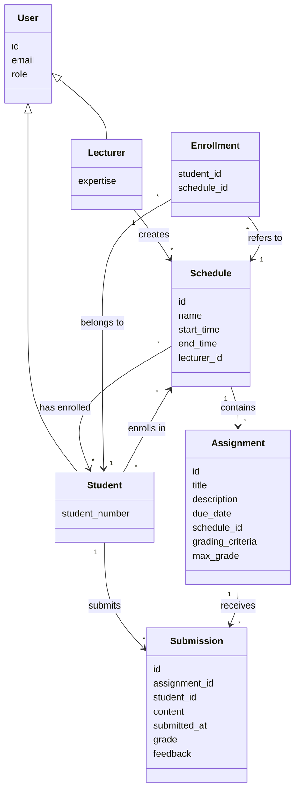

# Domain Model

## Entity Relationships



## Entity Descriptions

### User
Base entity that represents any user in the system.

### Lecturer
A type of user who creates and manages schedules and assignments.

### Student
A type of user who enrolls in schedules and submits assignments.

### Schedule
Represents a course or class session with specific timing.

### Enrollment
Junction entity that connects students to schedules they're enrolled in.

### Assignment
A task created by lecturers within a schedule that students must complete.

### Submission
A student's response to an assignment, which can be graded and receive feedback.
```<!-- filepath: /Users/user/Documents/Ucll/2nd Semester/Software Engineering/backend-bcs17/analysis/models/domain-model.md -->
# Domain Model

## Entity Relationships


## Entity Descriptions

### User
Base entity that represents any user in the system.

### Lecturer
A type of user who creates and manages schedules and assignments.

### Student
A type of user who enrolls in schedules and submits assignments.

### Schedule
Represents a course or class session with specific timing.

### Enrollment
Junction entity that connects students to schedules they're enrolled in.

### Assignment
A task created by lecturers within a schedule that students must complete.

### Submission
A student's response to an assignment, which can be graded and receive feedback.